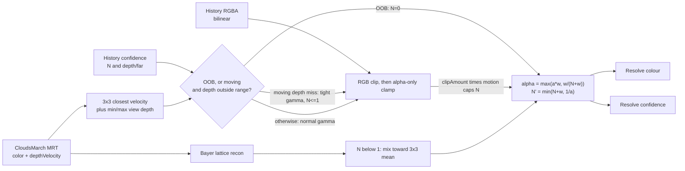

# Clouds TAAU Ghosting Reduction

## Goal and hard constraint

Sharp clouds, no long ghost trails, and no return of the film-grain jitter. The grain was removed by long temporal accumulation (`temporalUpscaleAlpha` 0.22 on the phase pixel, STBN slice held per 16-frame Bayer cycle). That accumulation is also what makes stale history live about a second. Settled pixels must keep today's blend. Only pixels with evidence of stale history may converge faster, and they must not flash the raw quarter-res reconstruction.

## What shipped

History is bilinear. RGB stays on the original variance box; alpha is clamped on its own with a 1/64 half-extent floor. The resolve writes a second attachment named `confidence` (RG16F, nearest): `r = N`, `g = view distance / cameraFar`. The name `meta` is reserved in WGSL and cannot be an output.

- Once `N = Nmax = 1/a`, `w / (N + w) <= a * w` for every `w` in [0, 1], so a settled pixel uses today's `alpha = a * w`.
- Off-screen reprojection sets `N = 0` and blends toward the neighbourhood mean. A depth miss or a colour clip caps `N` at 1 and only while the pixel is moving. Fast motion (`motionConfidenceFloor` 0) also drops `N` and shows the mean.
- Cost that shipped: one full-res RG16F attachment (read and write) and one confidence tap. History is one bilinear tap. The march resolution is unchanged. Wind and the shadow march were not changed.

## Decisions that replaced the first draft

1. **Half-float depth.** Sky writes `cameraFar` (demo far is 100000), which overflows RG16F. The confidence attachment stores `depth / cameraFar`. The march velocity target stays Float32.
2. **Unblended depth.** Mixing history depth with the current depth produces values that match neither surface. The attachment stores this frame's own low-res block depth.
3. **No raw-reconstruction flash.** `N = 0` shows the neighbourhood mean, not the Bayer sample. A depth miss or clip keeps `N` at 1 (about 50% history on the phase pixel).
4. **`Nmax = 1/a`, not `1/a - 1`.** The smaller cap would have given off-phase pixels more fresh weight and brought grain back. The blend is `max(a*w, w/(N+w))`.
5. **Alpha-only clamp.** A 4D box lets a jittering low-res alpha rescale stable RGB. RGB stays on `clipAABB`. Alpha uses its own box with a 1/64 floor. The confidence signal also floors the RGB extent at 2% of the mean, so interior noise does not cap `N`.
6. **Catmull-Rom was removed.** Bayer jitter leaves history off texel centres. The negative lobes blurred clouds, added a halo while rotating, and raised the still-camera probe.
7. **Depth is view distance on both sides.** Cloud hits used to store a ray distance in `depthVelocity.r`. The march now writes `rayDistance * max(dot(ray, cameraForward), 1e-4)` after the world-position reprojection, and leaves `.a = 1`. Closest-depth selection reads that same `.r`.
8. **Depth reject cannot see the edge band.** The 3x3 spans both surfaces within about one low-res texel (4–8 full-res pixels). A 15% window also fired on still Bayer depth jitter and brought the grain back. What shipped: history may sit in `[min / (1+tau), max * (1+tau)]` with `tau = 1` (half to double), and the reject runs only when `motion > 0.02`. The clip cap is multiplied by the same motion, so a still pixel does not lose confidence when the clip twitches.
9. **Motion acts only through `N`.** It replaces the old `motionSafe` mix. Floor 0 is the fast-pan cut and shows the neighbourhood mean. Floor 1 was tried as an idea and not taken: it would keep a short tail through a fast pan.
10. **Wind is deferred.** Interior smear with `?weather=1` is acceptable. A rigid `windVelocity` is still the right design if that smear becomes the target, because scrolling only the weather map cannot be one motion vector. `sampleMedia` is HIGH risk and was not touched.

## Why the old resolve ghosted

- **Long fixed memory.** `alpha = 0.22 * w`, with `w = exp(-d^2 / (2 * 0.55^2))` equal to 1 / 0.19 / 0.037 at 0 / 1 / 1.4 px from this frame's Bayer sample. Fresh mass per 16-frame cycle is about 0.42. A stale value needs about five cycles to fall to 10%. That memory is also the grain suppression.
- **A wide colour box.** Still pixels use `varianceGamma * varianceGammaStatic` (2 × 2 = 4) on a 3×3 low-res neighbourhood. Near an edge the box spans cloud and sky, so little clips.
- **No disocclusion test** in the original resolve. `depthVelocity.r` was only used to pick the closest velocity.

## Phases

### Phase 0: Baseline (done)

`cloudsStability()` on a static camera, 256 crop, 48 warmup + 64 pairs.

| Load | History | TAAU | Mean \|Δ luminance\| | Max |
| --- | --- | --- | --- | --- |
| no flags | on | on | 0.000204 | 0.154 |
| `?history=0` | off | on | 0.054979 | 0.958 |
| `?upscale=0` | on | off | 0.004026 | 0.352 |

The 0.000204 figure is that first crop. Later no-flags runs on the view used for the rest of the work sit near **0.0012**. The crop dominates the probe. Do not fail a later change for missing 0.000204. Compare against about 0.0012 on this view, and judge trails by eye.

Visual priority:

1. Cloud edges sliding over the sky.
2. Objects passing in front of clouds.
3. Interior smear with `?weather=1` is acceptable.

Measurements while the clip was being chosen (no flags, history on, TAAU on):

| Step | Mean \|Δ luminance\| | Max |
| --- | --- | --- |
| First crop | 0.000204 | 0.154 |
| Catmull-Rom + 4D clip | 0.001295 | 0.257 |
| Bilinear + 4D clip | 0.001286 | 0.202 |
| Bilinear + alpha-only clamp | 0.001292 | 0.208 |
| Original RGB clip restored | 0.001157 | 0.235 |

Ghosting was visibly worse without the alpha clamp. The higher probe number was not visible jitter. Catmull-Rom stayed out.

### Phase 1: Shared helpers (done)

- `varianceClipEx` returns colour, `clipAmount`, and the neighbourhood mean. `clipAlpha` clamps alpha only. Shadows keep the original `varianceClip` body.
- `closestDepthVelocityRange` walks the same neighbourhood as closest-depth selection and also returns min and max depth.
- Both cloud resolve branches opt into `clipAlpha`. History stays bilinear.

### Phase 2: Wind (deferred)

Not built. Interior weather smear is acceptable. The design, if it is picked up later:

- A rigid `windVelocity` (m/s along world X/Z) advances weather, shape, detail, and turbulence together and writes one world displacement.
- The cloud hit reprojection and `setupShadowMarchVelocity` subtract that displacement.
- `sampleMedia` would gain a `turbulenceOffset` uniform defaulting to 0. Impact is HIGH: the cloud march, shadow march, and optical-depth march all call it.

### Phase 3: Confidence attachment (done)

- `CloudsResolveColorNode` is an `MRTNode`. A plain TempNode does not emit the WGSL output struct and clears both attachments.
- Second attachment: RG16F, nearest, texture name `confidence`. `r = N`, `g = own-block view distance / cameraFar`. `clearHistory` clears both targets. `swapBuffers` swaps both. `historyConfidenceNode` is exposed.
- Phase 3 wrote `N' = min(N + w, Nmax)` and left the colour blend unchanged. Phase 4 is what uses `N`.
- Debug view `history-confidence`: green is `N / Nmax`, red is `N < 1`, blue is normalized depth. Still clouds read green; sky reads cyan because depth is 1.

### Phase 4: Confidence blend (done)

- `alpha = max(a * w, w / max(N + w, 1e-8))` with `Nmax = 1 / a`. `a` is `temporalUpscaleAlpha`, or `temporalAlpha` with `w = 1` on the full-res branch.
- Off-screen reprojection: `N = 0`.
- Depth reject, only when `motion > 0.02`: history depth outside `[min / (1+tau), max * (1+tau)]` of the 3×3 view-depth range, `tau = depthRejectTolerance` (default 1). Effect: `gamma = varianceGammaReject` (default 1) and `N = min(N, rejectConfidence)` (default 1).
- Motion: `N = min(N, mix(Nmax, motionConfidenceFloor, motion))`. Floor 0 replaces the old hard cut.
- Low confidence: `recon' = mix(neighbourhoodMean, recon, saturate(N / fallbackConfidence))`, `fallbackConfidence` 1.
- `varianceGammaStatic` (default 2), `depthRejectTolerance`, `varianceGammaReject`, and `rejectConfidence` are resolve uniforms. The first two are on `CloudsOptions` / `CloudsNode`. `varianceGammaStatic` stayed at 2. The clip-confidence cap was removed after a runtime A/B showed no difference.
- Signed-off still-camera probe on this view: mean **0.00127**, max **0.211**. Sky-edge smear was accepted. Pillar rims are the 4–8 px band the 3×3 cannot reject.

### Phase 5: Sign-off (done)

- Full-res TAA uses the same confidence, depth reject, and mean fallback, with `w = 1`, `a = temporalAlpha`, the 4-neighbour cross, and `gamma = 1` unless the depth test tightens it.
- `motionConfidenceFloor` stays 0. `varianceGammaStatic` stays 2.
- JSDoc on both temporal alphas says they also set `Nmax = 1 / alpha`. Quality presets do not override those defaults.
- `detect_changes({scope: "compare", base_ref: "main"})` returned `truncated: true` (the branch is far from `main`). That is not a clean check. `detect_changes({scope: "all"})` on the uncommitted cloud diff completed and rated it critical because it touches `CloudsNode` and the march. The shadow resolve is not in that diff.

## Where it lives

### `src/webgpu/temporalResolve.ts`

Shared with `ShadowResolveNode`. Shadow defaults are unchanged.

- `clipAABB` is the original RGB box.
- `varianceClip` is that box. Shadows call it.
- `cloudVarianceClip` is the cloud path: RGB clip, then an alpha-only clamp. It also returns `mean`.
- `closestDepthVelocityRange` returns the closest sample plus min and max of `.r`. The center texel is passed in. `closestOffsets` is the shared 3×3; clouds walk the copy that omits the center.

### `src/webgpu/CloudsResolveNode.ts`

- MRT outputs `output` (RGBA16F, linear) and `confidence` (RG16F, nearest).
- TAAU reconstructs the Bayer lattice, clips a 3×3 around that sample, and reads closest velocity plus the depth range from the low-res block.
- Own depth is `velocity.r / cameraFar` of that block, unblended.
- Output is `mix(clipped, reconFallback, alpha)` and confidence is `vec2(min(N + w, Nmax), ownDepth)`.
- `depthVelocity.r` is view distance. The hit-branch world position still uses the ray distance. `.a` stays 1.

### `src/webgpu/march.ts`

After the hit-branch reprojection, cloud hits store `frontDepth * max(dot(rayDirection, cameraDirection), 1e-4)` in `depthVelocity.r`. Scene and sky depths were already view distance (sky is `cameraFar`).

### Debug and demo

- `history-confidence` in `cloudsDebug.ts` and `#debug-output` in `index.html`.
- `?autorotate`, `?weather=1`, `?history=0`, `?upscale=0`, and `window.cloudsStability()`.

## Tunables

- `temporalUpscaleAlpha` 0.22 / `temporalAlpha` 0.1. Each sets `Nmax = 1/a` on its path.
- `varianceGamma` 2, `varianceGammaStatic` 2. Still TAAU pixels use gamma 4. Full-res uses gamma 1.
- `varianceGammaReject` 1.
- `depthRejectTolerance` 1, and only while `motion > 0.02`.
- `rejectConfidence` 1.
- `fallbackConfidence` 1. `motionConfidenceFloor` 0.
- Alpha extent floor 1/64.

## Verification

- Still-camera probe on this view stays near **0.0012** (signed off at 0.00127). The first-crop 0.000204 number is a different test.
- Sky-edge trails and objects in front of clouds, judged by eye. The accepted result is a short edge smear and a 4–8 px pillar rim.
- History confidence stays green on a still camera, including cloud edges.
- `ShadowResolveNode` was not switched to `clipAlpha` or the confidence buffer.
- `pnpm typecheck` and `biome lint` passed at sign-off.

## Optional follow-ups

- YCoCg clipping for chroma.
- A narrower edge box (nearest 2×2 low-res texels) if the 4–8 px pillar rim is still distracting.
- Rigid wind, if interior weather smear becomes the target.
