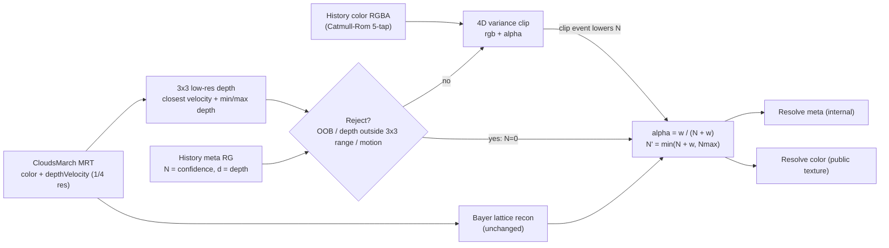

# Clouds TAAU Ghosting Reduction

## Why it ghosts today (from `src/webgpu/CloudsResolveNode.ts`, `temporalResolve.ts`, `march.ts`)

- **History is almost never rejected.** The only rejection is a colour AABB over a 3x3 *low-res* box (12x12 full-res px) with `gamma = varianceGamma * 2 = 4` when still. That box practically never clips, so stale history survives indefinitely on a static camera and for a long time under slow motion.
- **Per-pixel refresh is tiny and fixed.** `temporalUpscaleAlpha (0.22) * weight`, with `weight = exp(-d^2 / (2 * 0.55^2))` = 1 / 0.19 / 0.037 / 0.001 at 0 / 1 / 1.4 / 2 px from this frame's Bayer sample. Fresh mass per 16-frame cycle is ~0.42, so any reprojection error needs ~4 cycles (~68 frames, >1 s at 60 fps) to fade. That is the smear/trail length you see.
- **No disocclusion test.** `depthVelocity.r` (cloud front depth, or scene/far depth for sky) is fetched for velocity dilation but never compared against what the history pixel saw. Cloud edges trailing over sky/terrain are exactly this case: history says "cloud at depth d", current says "sky at far" and nothing rejects it.
- **Alpha is not clipped.** `clipAABB` builds the box on `.rgb` only and scales alpha by the same factor; over dark sky a translucent cloud ghost passes untouched.
- **Bilinear history resampling** every frame with ~0.58 retention per cycle low-pass filters the history (progressive blur = "smearing" under sub-pixel camera motion).
- **Cloud advection is not in the motion vectors.** `localWeatherOffset`/`shapeOffset` scroll each frame (`CloudsNode.updateBefore`) but `prevUv` in `march.ts` reprojects a fixed world point, so animated weather always mismatches history.

## Approach

Steady state is unchanged by construction: `Nmax = 1 / temporalUpscaleAlpha - 1` (about 3.5) makes `w / (Nmax + w)` equal today's `0.22 * w` on the phase pixel. Only the ramp after a reset changes (1, 1/2, 1/3 ... instead of a 68-frame fade). The march pass and its resolution are untouched, so the TAAU performance benefit is preserved; the added cost is one RG16F attachment and a few extra full-res texture taps.

## Implementation phases

Each phase is independently shippable, ends with a visual checkpoint in the demo and one commit. Later phases only start once the previous checkpoint holds, so a regression is always attributable to one change. Run `impact` before touching a new symbol and `detect_changes({scope: "all"})` before each commit.

### Phase 0: Baseline (no code)

- Reproduce the three ghosting cases in the demo and note/screenshot them: (a) orbit camera past a cloud edge over sky, (b) same over a terrain silhouette, (c) static camera with `Animate weather` on.
- Note static-camera grain level with `Temporal history` on (this must not regress).
- Resolve the stray `M src/webgpu/CloudsResolveNode.ts` (diff is empty, likely line endings) so Phase 1 starts clean.

### Phase 1: Shared helpers and drop-in fixes (Changes §1, part of §2)

- `temporalResolve.ts`: `clipAlpha` flag on `clipAABB`/`varianceClip` (default off), `clipAmount` in the return, `closestDepthVelocityRange`, `sampleCatmullRom`.
- `CloudsResolveNode.ts`: opt in to `clipAlpha`, swap the bilinear history fetch for `sampleCatmullRom` in both branches. No blend-formula or target changes yet.
- Checkpoint: shadows render identically (helpers default to old behaviour); clouds show less progressive blur during slow orbits and shorter translucent trails over sky. Grain unchanged.

### Phase 2: Meta history plumbing, output-identical (Changes §2 structure, §4 debug view)

- Convert `CloudsResolveColorNode` to `MRTNode`, add the second HalfFloat attachment (`N`, front depth) to both ping-pong targets, extend `clearHistory`/`swapBuffers`, expose `historyConfidenceNode`.
- Write `N' = min(N + w, Nmax)` and the blended depth to the meta target but keep `alpha = temporalUpscaleAlpha * w` for colour, so the resolved image is unchanged.
- Add the `history-confidence` debug view and `index.html` option now, to validate the meta contents.
- Checkpoint: composited output pixel-identical to Phase 1; debug view shows `N` saturating everywhere on a static camera and a plausible cloud-depth field. Resolve pass timing unchanged within noise.

### Phase 3: Confidence-driven blend and depth rejection (Changes §2 logic, §4 tunables)

- Switch colour blend to `alpha = w / (N + w)` with `Nmax` derived from `temporalUpscaleAlpha`.
- Add rejection: OOB, depth outside the 3x3 low-res `[min * (1 - tau), max * (1 + tau)]`, motion scaling, clip-event cap via `clipAmount`.
- Promote `TEMPORAL_UPSCALE_STATIC_GAMMA` to the `varianceGammaStatic` uniform; add `depthRejectTolerance`; wire both through `CloudsOptions`/`CloudsNode`.
- Checkpoint: cases (a) and (b) from Phase 0 converge within a few frames instead of about a second; debug view shows resets confined to edges/disocclusions; static grain identical to baseline (`N` still saturates). Then try `varianceGammaStatic` 1.5 and keep it only if grain does not return.

### Phase 4: Wind-aware reprojection (Changes §3)

- `cloudDisplacement` uniform on `CloudsMarchParameters`, subtracted from `frontPositionWorld` in the hit branch of `march.ts`.
- `CloudsNode.updateBefore` computes it from `localWeatherVelocity * dt * mapSize` (negated) plus an optional `cloudWorldVelocity` host override; zeroed in `resetTemporalHistory`.
- Checkpoint: case (c) no longer smears; the confidence view shows no resets inside cloud bodies while weather animates. Case (a)/(b) unaffected.

### Phase 5: Parity, tuning and sign-off

- Confirm the full-res TAA branch (`temporalUpscale = false`) uses the same rejection/confidence path with `w = 1`.
- Settle defaults in `CloudsResolveNode` and `qualityPresets` if any preset should differ; update the JSDoc on `temporalUpscaleAlpha` to describe `Nmax`.
- `pnpm typecheck`, lint, `detect_changes({scope: "compare", base_ref: "main"})`; final side-by-side against Phase 0 screenshots.
- Decide whether either optional follow-up (low-confidence spatial fallback, YCoCg clip) is worth a separate pass.

## Changes

### 1. `src/webgpu/temporalResolve.ts` (shared with `ShadowResolveNode`, keep defaults behaviour-preserving)

- `clipAABB(current, history, min, max, clipAlpha = false)`: when `clipAlpha`, build the box and `unit` over `rgba` instead of `rgb`.
- `varianceClip(...)`: pass `clipAlpha` through; additionally return `{ color, clipAmount, mean }` (or a sibling `varianceClipEx`) where `clipAmount = max(0, maximum - 1)` so the caller can lower confidence on hard clips. Keep the existing signature working for shadows.
- Add `closestDepthVelocityRange(...)`: same 3x3 walk as `closestDepthVelocity` but also returns `minDepth`/`maxDepth` of the neighbourhood (the 9 texels are already loaded).
- Add `sampleCatmullRom(textureNode, uv, texelSize)`: 5-tap Catmull-Rom (Jimenez) history fetch.

### 2. `src/webgpu/CloudsResolveNode.ts`

- Turn `CloudsResolveColorNode` into an `MRTNode` (same pattern and caveat comment as `CloudsMarchColorNode`/`ShadowMarchColorNode`): outputs `output` (RGBA color, unchanged public texture) and `meta` (RG16F: `r = N`, `g = front depth`).
- `createTarget` -> `count: 2`; second texture `RG`/`RGBA` HalfFloat, `NearestFilter`; `swapBuffers` also swaps `historyMetaNode`; `clearHistory` clears both attachments (meta clears to 0 so first frame has N = 0).
- TAAU branch:
  - `closest = closestDepthVelocityRange(velocityNode, nearestBlock)`; `depthCur = closest.r`, `depthMin/Max` from the 3x3.
  - `histMeta = historyMetaNode.sample(prevUv)`; `depthReject = histMeta.g < depthMin * (1 - tau) || histMeta.g > depthMax * (1 + tau)` with `tau = depthRejectTolerance` uniform (default ~0.15). Sky uses `cameraFar`, so a cloud ghost over sky fails the test immediately.
  - `N = inside && !depthReject ? histMeta.r : 0`; `N = mix(N, min(N, clipConfidenceCap), smoothstep(0, 1, clipAmount))`; `N *= 1 - motion`.
  - History color via `sampleCatmullRom(historyNode, prevUv, 1 / outputSize)`.
  - `alpha = w / (N + w)` (w = existing Gaussian weight, epsilon-guarded); `out = mix(clipped, recon, alpha)`; `metaOut = vec2(min(N + w, Nmax), mix(histDepth, depthCur, alpha))`.
  - Derive `Nmax` from `temporalUpscaleAlpha` so the existing uniform/public setter keeps its meaning.
  - Keep `TEMPORAL_UPSCALE_STATIC_GAMMA` but demote to a uniform (`varianceGammaStatic`, default 2) so it can be tuned down now that depth rejection carries the load.
- Full-res TAA branch: same meta write with `w = 1`, same depth reject and Catmull-Rom so both paths behave consistently (minimal extra code, shares helpers).
- Expose `historyConfidenceNode` getter (meta texture) for debugging.

### 3. `src/webgpu/march.ts` + `src/webgpu/CloudsMarchNode.ts` + `src/webgpu/CloudsNode.ts` (wind-aware reprojection)

- `CloudsMarchParameters.cloudDisplacement = uniform(new Vector3())` (world units the cloud field moved since last frame).
- `march.ts` hit branch: `prevClip = reprojectionMatrix * vec4(frontPositionWorld - cloudDisplacement, 1)`.
- `CloudsNode.updateBefore`: after advancing offsets compute `displacement.xz = -(localWeatherVelocity * dt) * mapSize` (weather UV -> world via `getFlatUv` inverse), plus optional host override `cloudWorldVelocity: Vector3` (world units/s) added on top; write to `marchNode.march.cloudDisplacement.value`. Reset to 0 in `resetTemporalHistory`.

### 4. Debug and demo wiring

- `src/webgpu/cloudsDebug.ts`: add `'history-confidence'` view (`N / Nmax` in green, depth-reject/reset pixels in red) reading `resolveNode.historyConfidenceNode`; add `<option>` in `index.html` `#debug-output`.
- `CloudsOptions`/`CloudsNode` facade: `depthRejectTolerance`, `varianceGammaStatic` getters/setters (same pattern as `varianceGamma`).

## Tunables (defaults chosen to keep today's converged look)

- `temporalUpscaleAlpha` 0.22 (unchanged; now defines `Nmax`)
- `varianceGammaStatic` 2 (x `varianceGamma` 2 = today's 4); try 1.5 once depth rejection is in
- `depthRejectTolerance` 0.15 relative
- `clipConfidenceCap` 1 (hard clip drops a pixel to about one sample of history)

## Verification

- Demo (`pnpm dev`): orbit camera over cloud edges against sky and over terrain silhouettes; toggle `Temporal history` and compare trail length; enable `Animate weather` with a static camera to confirm wind reprojection removes the boil-smear; open `history-confidence` view to confirm resets happen only at edges/disocclusions and converge in a few frames.
- Confirm no grain regression on a static camera (converged pixels must be identical in behaviour: N saturates at Nmax).
- `pnpm typecheck` / lint; `ShadowResolveNode` output unchanged (defaults preserved in shared helpers).
- Run `detect_changes({scope: "all"})` before committing (GitNexus rule). Pre-edit `impact` already run: `CloudsResolveColorNode`, `clipAABB`/`varianceClip` (also used by `ShadowResolveNode`), `setupCloudsMarch` are all LOW risk.

## Optional follow-ups (not in this pass)

- Low-confidence spatial fallback: blend `recon` toward the already-computed 3x3 low-res mean when `N` is small to hide the one-to-three-frame re-convergence grain at disocclusion edges.
- YCoCg-space clipping for a tighter box on chroma differences.

