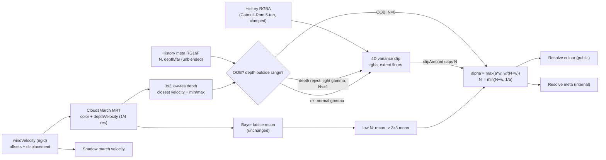

# Clouds TAAU Ghosting Reduction

## Goal and hard constraint

Sharp clouds, no ghost trails or smears, and **no return of the film-grain jitter**. The grain was removed by long temporal accumulation (`temporalUpscaleAlpha` 0.22 on the phase pixel, STBN slice held per 16-frame Bayer cycle). That accumulation is also what makes stale history live ~1 s. So the rule for every change below is: **converged pixels must accumulate exactly as today**; only pixels with evidence of stale history may converge faster, and even those must never flash the raw quarter-res reconstruction.

## Review of the original plan (what changed and why)

The original direction (confidence-driven blend, rejection, Catmull-Rom, wind-aware vectors) is right. These points would have broken or backfired and are fixed below:

1. **Half-float depth overflows.** The meta attachment was RG16F storing raw front depth. The demo has `camera.far = 100000`, and sky pixels write `cameraFar`; half float tops out at 65504, so sky depth becomes `Inf`. The march velocity target is `FloatType` for this reason. Fix: store `depth / cameraFar` (0..1, sky = 1) in RG16F.
2. **Blended depth causes false rejections.** `mix(histDepth, depthCur, alpha)` produces in-between depths (for example 26 km between a 5 km cloud and 100 km sky) that fail the range test against *both* surfaces. Every edge pixel would reset for many frames, which is exactly the flicker to avoid. Fix: store this frame's unblended depth of the pixel's own low-res block.
3. **Hard reset brings grain back at every disocclusion.** With `N = 0`, the pixel shows the raw tent reconstruction, and `N` only grows by about 1.9 per 16-frame cycle, so a reset region shimmers with the Bayer lattice for about 30 frames. Fix: only off-screen reprojection hard-resets. Depth-reject and clip events clamp history to a *tight* box and cap `N` at 1, which keeps about 50 % history on the phase pixel and 84 % elsewhere. Low-confidence pixels also blend toward the 3x3 neighbourhood mean (promoted from "optional follow-up" to required).
4. **Steady state was not actually unchanged.** `w / (Nmax + w)` with `Nmax = 1/a - 1` matches today only at `w = 1`. Off-phase pixels would get about 20 % more fresh weight, so about 10 % more fresh mass per cycle, which means slightly more grain. Fix: `alpha = max(a * w, w / (N + w))` with `Nmax = 1/a`. That is bit-for-bit today's blend once `N` saturates, and it is continuous during the ramp.
5. **Alpha clipping needs an extent floor.** In opaque interiors alpha is almost constant (σ ≈ 0, extent 1e-7), so any tiny history alpha difference makes the clip fire. The new `clipAmount` confidence signal would then drop `N` across entire cloud bodies. Fix: floor the alpha half-extent (default 1/64) and floor the rgb extent relative to the mean.
6. **Wind displacement formula was wrong, and wind alone doesn't make it correct.**
   - The weather UV is `uv * localWeatherRepeat + localWeatherOffset`, so the world motion is `-dOffset / repeat * mapSize`. The plan was missing the `/ repeat`.
   - More fundamentally, the demo's "Animate weather" scrolls **only** the weather map (0.001 UV/s × 80 km, which is 80 m/s). The 3D shape and detail noise and the turbulence stay fixed in world space. No single motion vector is right for that: compensating by the weather motion smears interior detail, and not compensating smears the silhouettes. Fix: add a rigid `windVelocity` that advances weather, shape, detail and turbulence offsets consistently, so one world displacement is exact. The per-texture velocities stay available as uncompensated "evolution".
7. **BSM shadow history also lags under wind (missing from the plan).** The shadow resolve uses `temporalAlpha = 0.01` (~100-frame memory) and its velocity (`setupShadowMarchVelocity`) ignores wind. At 80 m/s the self-shadowing lags up to ~100 m, which shows as lighting sliding across moving clouds. Fix: apply the same displacement in the shadow reprojection. The shared temporal helpers keep their defaults, so shadow output with wind off is unchanged.
8. **Depth rejection has a limited reach (set expectations).**
   - The 3x3 low-res range spans both surfaces within about 1 low-res texel (4-8 full-res px) of any edge, so it cannot fire there.
   - Over pure sky, the existing rgb clip already removes ghosts, because the box is `[0, 0]` and alpha is scaled along with rgb.
   - Depth rejection therefore mainly helps where clouds are revealed behind terrain or landmarks.
   - Inside the edge band, what helps is correct vectors (wind), Catmull-Rom, and the faster confidence ramp.
9. **Motion handling was duplicated.** `N *= 1 - motion` on top of the existing `motionSafe` hard cut double-counts. Motion now acts only through `N`. Today's full cut at high speed is also a source of jitter during fast pans, so Phase 5 A/Bs a floor instead of 0.
10. **Phase order.** Wind compensation is independent of the confidence buffer and is probably the largest visible win in the demo, so it moves up to Phase 2.
11. The stray `CloudsResolveNode.ts` diff is gone (working tree is clean), so that Phase 0 item is dropped.

## Why it ghosts today (from `CloudsResolveNode.ts`, `temporalResolve.ts`, `march.ts`, `CloudsNode.ts`)

- **Long fixed memory.** `alpha = 0.22 * w`, where `w = exp(-d^2 / (2 * 0.55^2))` is 1 / 0.19 / 0.037 at 0 / 1 / 1.4 px from this frame's Bayer sample.
  - Fresh mass per 16-frame cycle is about 0.42, and retention per cycle is about 0.63.
  - A stale value therefore needs about 5 cycles (~80 frames, ~1.3 s at 60 fps) to fall to 10 %.
  - This memory is also the grain suppression, so it must stay for converged pixels.
- **Rejection is colour-only and wide.** It uses a 3x3 bilinear low-res box with `gamma = 4` when still. Near edges the box spans cloud and sky/terrain, so nothing clips.
- **No disocclusion test.** `depthVelocity.r` is only used for velocity dilation.
- **Wind is not in the motion vectors.** The demo wind (80 m/s) moves a cloud 3 km away by about 0.45 px/frame at 1080p. With the ~80-frame memory that becomes a smear tens of pixels long, and the lighting smears too because the BSM history lags.
- **Bilinear history resampling** blurs progressively under sub-pixel camera motion. With a static camera it has no effect, because `prevUv` lands exactly on texel centres.

## Approach

- **Steady state is unchanged by construction.** Once `N = Nmax = 1/a`, `w / (N + w) <= a * w` for every `w` in [0, 1], so `alpha = a * w`, which is today's formula.
- **After a reset or rejection the ramp is roughly harmonic**, ending in about 2 cycles instead of the ~5-cycle exponential fade. It is never a raw-reconstruction flash, because rejected pixels start at `N = 1` with clamped history, and hard-reset pixels blend toward the spatial mean.
- **Cost.** The march pass and its resolution are untouched. The added resolve cost is one full-res RG16F attachment (read + write), 4 extra history taps (Catmull-Rom) and one meta tap. The shadow and march changes are one uniform each.

## Implementation phases

Each phase ships on its own and ends with a visual checkpoint plus the stability-probe number, then one commit. Run `impact` before touching each symbol and `detect_changes({scope: "all"})` before each commit.

### Phase 0: Baseline (done)

`cloudsStability()` on a static camera, 256 crop, 48 warmup + 64 pairs. Every later phase must keep the history-on / TAAU mean within noise of **0.000204**.

| Load | History | TAAU | Mean \|Δ luminance\| | Max |
| --- | --- | --- | --- | --- |
| no flags | on | on | 0.000204 | 0.154 |
| `?history=0` | off | on | 0.054979 | 0.958 |
| `?upscale=0` | on | off | 0.004026 | 0.352 |

History-on TAAU is about 270× quieter than history-off. Full-res TAA is about 20× noisier than TAAU; that is expected (`temporalAlpha` 0.1 every pixel) and is not the target.

Visual priority, from the orbit and weather passes:

1. Cloud edges sliding over the sky. This is the distracting trail.
2. Objects passing in front of clouds. Same class of stale history, and the one the depth test has to get right. Cloud `frontDepth` is a ray distance and scene depth is view-Z, so Phase 4 must compare them in one space or this case will not reject.
3. Interior smear with `?weather=1` is acceptable. Wind reprojection (Phase 2) stays in the plan but is not the first thing to judge.

Phase 1 measurements, no-flags probe (history on, temporal upscaling):

| Step | Mean \|Δ luminance\| | Max |
| --- | --- | --- |
| Phase 0 | 0.000204 | 0.154 |
| Catmull-Rom + 4D alpha clip | 0.001295 | 0.257 |
| Bilinear + 4D alpha clip | 0.001286 | 0.202 |
| Bilinear + alpha-only clamp | 0.001292 | 0.208 |

| Original clip restored | 0.001157 | 0.235 |

The original clip measures the same as the alpha clip, so 0.000204 and ~0.0012 are not the same test. The center crop dominates the probe. Ghosting was visibly worse without the alpha clamp, and the higher probe number was not visible jitter. The cloud resolve opts back into alpha-only clamping. Catmull-Rom stays out. Do not fail a later phase for missing 0.000204. Compare against ~0.0012 on this view, and judge trails by eye.

### Phase 1: Shared helpers and drop-in fixes (Changes §1, part of §4)

- `temporalResolve.ts` additions, all defaulting to today's behaviour so `ShadowResolveNode` is unaffected:
  - A `clipAlpha` flag with an extent floor.
  - `clipAmount` in the return value.
  - `closestDepthVelocityRange`.
- `CloudsResolveNode.ts`: opt in to `clipAlpha` in both branches. History stays bilinear. Catmull-Rom was tried and removed: under temporal upscaling the Bayer jitter leaves history off texel centres, and the negative lobes raised the static probe from 0.000204 to 0.001295 and added blur plus halos while rotating.
- Checkpoint:
  - Static-camera probe back near 0.000204.
  - Sky-edge trails still shorter than Phase 0 (that was the alpha clip).
  - No new halo while rotating.

### Phase 2: Rigid wind and wind-aware reprojection (Changes §3)

- `CloudsEnvironment.cloudDisplacement = uniform(new Vector3())`: world units the cloud field moved this frame. It lives on the environment so both the cloud march and the shadow march read it.
- `CloudsNode.windVelocity: Vector2` (m/s along world X/Z, mirroring `localWeatherVelocity`). In `updateBefore`, before the shadow pass, with `D = (V.x, 0, V.y) * worldUnitsPerMeter * dt`:
  - `localWeatherOffset -= D.xz / mapSize * localWeatherRepeat`
  - `shapeOffset -= D / worldUnitsPerMeter * shapeRepeat`, and the same for `shapeDetailOffset` with `shapeDetailRepeat`
  - `turbulenceOffset -= D.xz / mapSize * localWeatherRepeat * turbulenceRepeat` (new uniform, see below)
  - `environment.cloudDisplacement = D`, set every frame and 0 when `dt = 0`
- The existing per-texture velocities keep working as uncompensated "evolution". Document in JSDoc that `windVelocity` is the one to use for translation.
- `march.ts` hit branch: `prevClip = reprojectionMatrix * vec4(frontPositionWorld - cloudDisplacement, 1)`. The sky/scene branch is unchanged.
- `shadowSampling.ts` `setupShadowMarchVelocity`: subtract the same displacement from `frontPositionWorld`.
- `sampling.ts` `sampleMedia`: add `turbulenceOffset` to `turbulenceUv`. **Impact is HIGH:** the cloud march, shadow march and optical-depth march all call it. The change is uniform-only and defaults to 0, so all three stay identical until wind is used, and they must stay consistent with each other. Verify with wind off.
- Demo: `Animate weather` sets `windVelocity` to (-80, 0), equivalent to today's 0.001 UV/s over 80 km, instead of `localWeatherVelocity`. 80 m/s is extreme; consider 20-30 m/s once the A/B is done.
- Checkpoint:
  - Case (c): silhouettes and interior detail no longer smear.
  - Lit and shadowed regions move with the cloud instead of sliding.
  - Wind off: probe and screenshots identical to Phase 1.

### Phase 3: Meta history plumbing, output-identical (Changes §2 structure, §4 debug view)

- Convert `CloudsResolveColorNode` to an `MRTNode`. Keep the same caveat comment as `CloudsMarchColorNode`: a plain TempNode silently clears the attachments.
- Add a second attachment, RG16F `NearestFilter`: `r = N`, `g = own-block depth / cameraFar`. Extend `clearHistory` (clears to 0) and `swapBuffers`, and add a `historyConfidenceNode` `outputTexture` that is swapped as well.
- Write `N' = min(N + w, Nmax)` and the depth, but keep today's colour blend, so the image is unchanged.
- Add the `history-confidence` debug view and the `index.html` option now, to validate the meta contents.
- Checkpoint:
  - Colour pixel-identical to Phase 2.
  - `N` saturates everywhere on a static camera.
  - The depth field is plausible, with sky = 1.
  - Resolve timing unchanged within noise.

### Phase 4: Confidence blend with soft rejection (Changes §2 logic, §4 tunables)

- Blend: `alpha = max(a * w, w / max(N + w, 1e-4))` with `Nmax = 1 / a`, where `a` = `temporalUpscaleAlpha`, or `temporalAlpha` with `w = 1` on the full-res branch.
- Rejection and confidence:
  - Off-screen reprojection: `N = 0`.
  - Depth reject: history depth outside `[min * (1 - tau), max * (1 + tau)]` of the 3x3 low-res range. The effect is `gamma = varianceGammaReject` (default 1) and `N = min(N, rejectConfidence)` (default 1; 0 = hard reset, for A/B).
  - Clip event: `N = mix(N, min(N, clipConfidenceCap), smoothstep(0, 1, clipAmount))`.
  - Motion: `N = min(N, mix(Nmax, motionConfidenceFloor, motion))`. The floor defaults to 0, which is today's hard cut. It replaces `motionSafe` rather than stacking with it.
- Low-confidence spatial fallback:
  - `recon' = mix(neighbourhoodMean, recon, saturate(N / fallbackConfidence))`, with `fallbackConfidence` defaulting to 1.
  - It reuses the `mean` already computed by `varianceClip`.
  - It only affects pixels that are off-screen, reset, or moving fast.
- Promote `TEMPORAL_UPSCALE_STATIC_GAMMA` to a `varianceGammaStatic` uniform (default 2). Add `depthRejectTolerance`, `varianceGammaReject`, `rejectConfidence` and `clipConfidenceCap` uniforms. Expose the first two through `CloudsOptions`/`CloudsNode` with the same pattern as `varianceGamma`. Keep the rest internal until tuned.
- Checkpoint:
  - Cases (a) and (b): trails outside the ~4-8 px edge band converge within about 1-2 cycles.
  - Revealed-behind-terrain regions show no dark halo and no shimmer.
  - The confidence view shows resets confined to edges and disocclusions, and no resets inside cloud bodies with wind on.
  - **The static probe equals baseline.**
  - Then try `varianceGammaStatic` 1.5 and keep it only if the probe does not rise.

### Phase 5: Parity, tuning and sign-off

- Confirm the full-res TAA branch (`temporalUpscale = false`) uses the same meta, rejection and fallback path with `w = 1`.
- A/B `motionConfidenceFloor` at 1 against 0 on fast pans. The floor removes quarter-res shimmer while moving; keep it if no smear appears at fast rotation.
- Settle defaults in `CloudsResolveNode` and `qualityPresets`. Update the JSDoc on `temporalUpscaleAlpha` / `temporalAlpha` to say they also set `Nmax`.
- Run `pnpm typecheck`, lint, and `detect_changes({scope: "compare", base_ref: "main"})`. Do a final side-by-side against the Phase 0 screenshots and probe numbers.

## Changes

### 1. `src/webgpu/temporalResolve.ts` (shared with `ShadowResolveNode`; defaults preserve behaviour)

- `clipAABB(current, history, min, max, options?)`:
  - `clipAlpha`: build the box and `unit` over rgba instead of rgb.
  - `minExtent: vec4`: half-extent floor, default 1e-7, the same as today. Clouds pass rgb `max(1e-7, 0.02 * mean)` and alpha 1/64.
  - Return `{ color, clipAmount = max(0, maximum - 1) }` from a sibling (`clipAABBEx` / `varianceClipEx`) so the existing call signatures stay as they are for shadows.
- `varianceClip`: pass the options through. The `Ex` variant also returns `mean` for the spatial fallback.
- `closestDepthVelocityRange(...)`: the same 3x3 walk, also returning min and max depth (the texels are already loaded).
- `sampleCatmullRom(textureNode, uv, texelSize)`: 5-tap (Jimenez) on the bilinear history, returning `vec4(max(rgb, 0), saturate(a))`.

### 2. `src/webgpu/CloudsResolveNode.ts`

- `CloudsResolveColorNode` becomes an `MRTNode` with outputs `output` (public RGBA, unchanged) and `meta` (RG16F).
- `createTarget`: `count: 2`, with `textures[1]` set to HalfFloat RG (or RGBA if RG MRT misbehaves) and `NearestFilter`. `clearHistory` clears both, `swapBuffers` swaps both nodes, and `historyConfidenceNode` is exposed.
- TAAU branch:
  - `closest = closestDepthVelocityRange(velocityNode, nearestBlock)`. Velocity dilation uses the closest texel as today, and the range comes from the same walk.
  - `ownDepth = velocityNode.load(nearestBlock).r / cameraFar`. The meta output stores this: unblended, the pixel's own surface.
  - `histMeta = historyMetaNode.load(ivec2(prevUv * outputSize))`, a nearest fetch with no filtering across surfaces.
  - Rejection, gamma and `N` as described in Phase 4. History colour comes from `sampleCatmullRom(historyNode, prevUv, 1 / outputSize)`.
  - Output: `out = mix(clipped, reconFallback, alpha)` and `meta = vec2(min(N + w, Nmax), ownDepth)`.
- Full-res TAA branch: the same logic with `w = 1`, `a = temporalAlpha`, its existing 4-neighbour cross and `gamma = 1`, plus the reject gamma.
- Caveat: cloud `frontDepth` is a ray distance, while scene and sky depths are view-Z. Comparisons within one surface type are consistent. Converting cloud depth to view-Z in `march.ts` is a separate, optional cleanup; it would also change closest-depth selection.

### 3. Wind: `CloudsEnvironment.ts`, `CloudsNode.ts`, `march.ts`, `shadowSampling.ts`, `sampling.ts`, `parameters.ts`, `CloudsOptions.ts`, demo

- `CloudsEnvironment.cloudDisplacement` (`Vector3`) plus the `cloudDisplacementNode` uniform.
- `CloudParameterNodes.turbulenceOffset = uniform(new Vector2())`; `sampleMedia` uses `turbulenceUv = uv * localWeatherRepeat * turbulenceRepeat + turbulenceOffset`.
- `CloudsNode.windVelocity` plus a `windVelocity` facade option. The offset and displacement updates are in Phase 2. `resetTemporalHistory` needs no change, because the displacement is recomputed every frame.
- `march.ts` hit-branch reprojection and `setupShadowMarchVelocity` subtract the displacement.
- Demo `bindCloudControls.ts` `updateAnimation`: `windVelocity` instead of `localWeatherVelocity`.

### 4. Debug and demo wiring

- `cloudsDebug.ts`: a `'history-confidence'` view showing `N / Nmax` in green and `N < 1` (reset or reject) in red, read from `historyConfidenceNode`. Add the matching `<option>` to `#debug-output` in `index.html`.
- Demo: the `?autorotate` flag and the `window.cloudsStability()` probe from Phase 0.

## Tunables (defaults keep today's converged look)

- `temporalUpscaleAlpha` 0.22 / `temporalAlpha` 0.1: unchanged. They now also define `Nmax = 1/a`.
- `varianceGammaStatic` 2 (× `varianceGamma` 2 = today's 4); try 1.5 in Phase 4.
- `varianceGammaReject` 1: tight clip on depth-rejected pixels.
- `depthRejectTolerance` 0.15, relative.
- `rejectConfidence` 1; 0 = hard reset (A/B only).
- `clipConfidenceCap` 1.
- `fallbackConfidence` 1: below it, blend toward the 3x3 mean.
- `motionConfidenceFloor` 0 = today's behaviour; A/B 1 in Phase 5.
- Alpha extent floor 1/64; rgb extent floor 2 % of the mean.

## Risk notes (GitNexus impact, upstream)

- `clipAABB`, `varianceClip`, `setupCloudsMarch`, `CloudsResolveColorNode`, `setupShadowMarchVelocity`: LOW.
- `CloudsEnvironment`: MEDIUM (14 direct users). Adding a field and a uniform only.
- `sampleMedia`: **HIGH** (called by the cloud march, shadow march and optical-depth march). The only change is an additive uniform that defaults to 0; verify output is identical with wind off before continuing.

## Verification

- Every phase: the static-camera stability probe is within noise of the Phase 0 baseline. This is the grain guard; do not judge grain by eye alone.
- Cases (a), (b) and (c) via `?autorotate` and `Animate weather`, compared side by side with the Phase 0 screenshots. Also check that resets in the `history-confidence` view stay confined to edges and disocclusions.
- No halos around bright cloud edges (Catmull-Rom clamp).
- `ShadowResolveNode` output unchanged with wind off.
- `pnpm typecheck` and lint. Run `detect_changes({scope: "all"})` before each commit and `detect_changes({scope: "compare", base_ref: "main"})` at sign-off.

## Optional follow-ups (not in this pass)

- YCoCg-space clipping for a tighter box on chroma differences.
- Cloud front depth as view-Z in `march.ts`, for consistent depth semantics across surface types.
- A narrower edge-band box (nearest 2x2 low-res texels instead of the 3x3 bilinear footprint), if trails inside the 4-8 px edge band are still visible after Phase 4.
