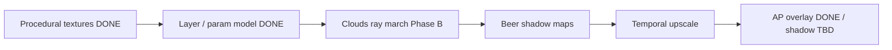

# @takram/three-clouds/webgpu

Work-in-progress WebGPU / TSL support for `@takram/three-clouds`.

The WebGL path (`CloudsEffect` + GLSL) remains the full volumetric renderer. WebGPU currently covers **procedural textures**, **layer/parameter packing**, a **Phase B ray march** (`CloudsNode` / `CloudsMarchNode`), and **aerial-perspective overlay** compositing. Beer shadow maps, temporal upscale, and shadow-length shafts are not ported yet.

Once all packages support WebGPU, the shader-chunk-based architecture will be archived and superseded by the node-based implementation (same plan as [`@takram/three-atmosphere/webgpu`](../atmosphere/WEBGPU.md)).

## Status

| Area | WebGL | WebGPU |
| --- | --- | --- |
| Local weather / shape / shape detail / turbulence textures | `LocalWeather`, `CloudShape`, … | `LocalWeatherNode`, `CloudShapeNode`, … |
| Noise (tileable Perlin / Worley) | GLSL | TSL (`perlinNoise.ts`, `stackableNoise.ts`) |
| Layer / parameter packing + density sampling | `uniforms.ts`, `clouds.glsl` | `CloudParameterNodes`, `CloudLayerParameterNodes`, `sampling.ts` |
| Package export | `@takram/three-clouds` | `@takram/three-clouds/webgpu` |
| Volumetric ray march (`CloudsPass`) | Done | Phase B spike (`CloudsMarchNode` / `CloudsNode`) — no BSM, reduced secondary rays |
| Beer shadow maps + cascade splits | Done | Missing |
| Temporal resolve / TAAU | Done | Missing |
| Atmosphere overlay / cloud shadow compositing | Via `AerialPerspectiveEffect` | `AerialPerspectiveNode.overlayNode` (shadow / shadowLength still missing) |
| R3F `Clouds` / full-sky stories | Done | Storybook Basic only (no R3F yet) |

## Examples

Procedural texture viewers live in WebGPU Storybook under **clouds / Procedural Texture**. The Phase B volumetric spike is under **clouds / Clouds → Basic**:

```sh
pnpm exec nx storybook-webgpu
# http://localhost:4400/?path=/story/clouds-clouds--basic
```

Compare against WebGL:

```sh
pnpm exec nx storybook
# http://localhost:4400/?path=/story/clouds-clouds--basic
```

## Usage (Phase B overlay)

```ts
import { context, pass } from 'three/tsl'
import { PostProcessing, type Renderer } from 'three/webgpu'

import {
  aerialPerspective,
  AtmosphereContext
} from '@takram/three-atmosphere/webgpu'
import { clouds } from '@takram/three-clouds/webgpu'

declare const renderer: Renderer
declare const scene: import('three').Scene
declare const camera: import('three').Camera

const atmosphereContext = new AtmosphereContext()
atmosphereContext.camera = camera
renderer.contextNode = context({
  ...renderer.contextNode.value,
  getAtmosphere: () => atmosphereContext
})

const cloudsNode = clouds()
cloudsNode.coverage = 0.4
cloudsNode.resolutionScale = 0.5

const passNode = pass(scene, camera, { samples: 0 })
const aerialNode = aerialPerspective(
  passNode.getTextureNode('output'),
  passNode.getTextureNode('depth')
)
aerialNode.overlayNode = cloudsNode

const postProcessing = new PostProcessing(renderer, aerialNode)
postProcessing.render()
```

Note: prefer assigning the `CloudsNode` itself (not only `getTextureNode()`) so its `updateBefore` runs as part of the compose graph. `PostProcessing` was renamed to `RenderPipeline` in three r183 — both still work.
Peer dependency note (same as atmosphere WebGPU):

```
"three": ">=0.182.0"
```

## Roadmap to volumetric WebGPU clouds

Ordered by dependency (mirror atmosphere: LUTs / textures first, then lighting, then advanced passes):

1. **Stabilize texture nodes** — one-shot compute (`needsCompute`, matching WebGL `needsRender`); Storybook parity with Building Blocks. **Done.**
2. **Shared layer / parameter model in TSL** — port `CloudLayer` packing, density profile, coverage filters, weather/shape/media sampling. **Done** (`parameters.ts`, `updateCloudLayerParameters.ts`, `sampling.ts`).
3. **Primary clouds ray-march node** — TSL port of `clouds.frag` / `clouds.glsl`. **Phase B done** (`CloudsMarchNode`, `CloudsNode`, `AerialPerspectiveNode.overlayNode`, Basic story). Still missing: BSM sampling, shape detail/turbulence by default, STBN, beer-powder, full secondary-ray quality.
4. **Beer shadow maps** — cascaded sun-view ray march + temporal resolve (`ShadowPass` / `ShadowResolve`).
5. **Temporal upscale resolve** — TAAU-like history (`CloudsResolve`); can lean on `@takram/three-geospatial/webgpu` `TemporalAntialiasNode`.
6. **Atmosphere compositing** — overlay **done**; still need cloud shadow map + shadowLength inputs matching WebGL `CloudsEffect` → `AerialPerspectiveEffect`.
7. **Light shafts / cloud shadow length** — WebGL writes `shadowLength` for crepuscular rays; WebGPU already has epipolar `ShadowLengthNode` for atmosphere — needs a cloud-driven length path.
8. **Public API + stories** — R3F wrapper, quality presets, CustomLayers / 3D-tiles stories.



## WebGL rendering path (reference)

From the main [README](./README.md):

1. **Shadow** — sun orthographic BSM ray march
2. **Shadow resolve** — temporal filter on BSM
3. **Clouds** — camera ray march into color / depth-velocity / shadow-length buffers
4. **Clouds resolve** — TAAU (~1/16 ray-march cost)
5. **Aerial perspective** — composites overlay + applies atmosphere

WebGPU must reproduce this contract without `postprocessing` `Effect` classes, using TSL nodes and `WebGPURenderer` compute / render targets instead.
